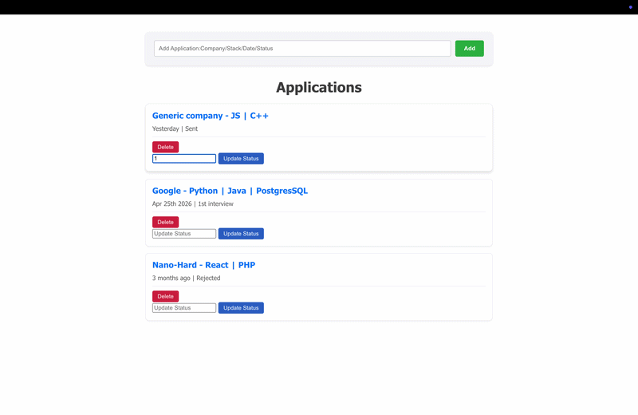

# Interactive Job Application Dashboard

## Nothing too fancy does what it says it does.




##  Tech Stack
*   **Frontend:** React
*   **Backend:** Python (Flask)
*   **Database:** PostgreSQL

---

##  How to Run

### 1. Backend (Flask)
1. Navigate to the `backend` folder:
   ```bash
   cd backend
   ```
2. Create and activate a virtual environment:
   ```bash
   python -m venv venv
   source venv/bin/activate  # On Windows: venv\Scripts\activate
   ```
3. Install dependencies:
   ```bash
   pip install -r requirements.txt
   ```
4. Start the server:
   ```bash
   python main.py
   ```

### 2. Frontend (React)
1. Navigate to the `frontend` folder:
   ```bash
   cd frontend
   ```
2. Install dependencies:
   ```bash
   npm install
   ```
3. Start the development server:
   ```bash
   npm start
   ```

### 3. Database (PostgreSQL)
* Ensure **PostgreSQL** is running on your machine.
* Update the database connection string in `backend/main.py` if necessary.
